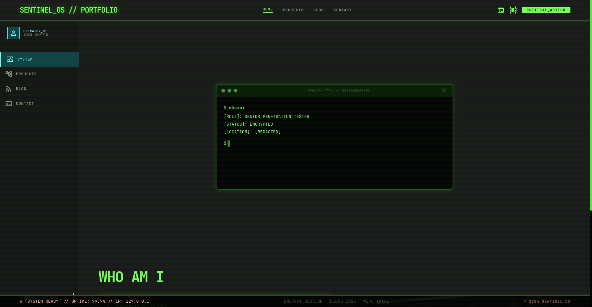
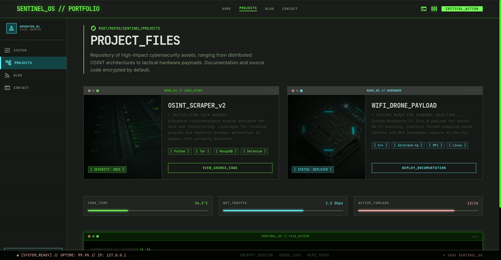
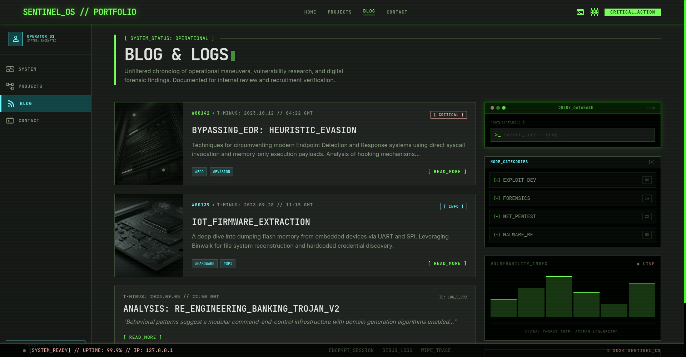
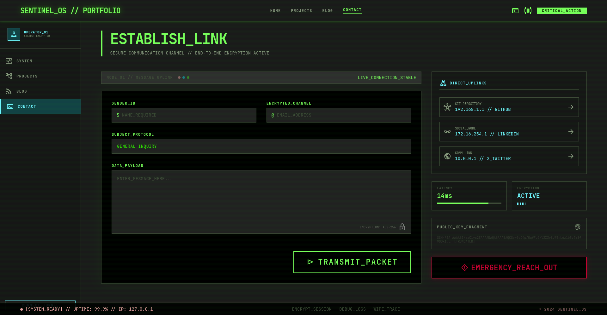

<div align="center">

```
███████╗███████╗███╗   ██╗████████╗██╗███╗   ██╗███████╗██╗      ██████╗ ███████╗
██╔════╝██╔════╝████╗  ██║╚══██╔══╝██║████╗  ██║██╔════╝██║     ██╔═══██╗██╔════╝
███████╗█████╗  ██╔██╗ ██║   ██║   ██║██╔██╗ ██║█████╗  ██║     ██║   ██║███████╗
╚════██║██╔══╝  ██║╚██╗██║   ██║   ██║██║╚██╗██║██╔══╝  ██║     ██║   ██║╚════██║
███████║███████╗██║ ╚████║   ██║   ██║██║ ╚████║███████╗███████╗╚██████╔╝███████║
╚══════╝╚══════╝╚═╝  ╚═══╝   ╚═╝   ╚═╝╚═╝  ╚═══╝╚══════╝╚══════╝ ╚═════╝ ╚══════╝
```

**`SENTINEL_OS // PORTFOLIO`** — A hacker-aesthetic portfolio template built for cybersecurity professionals, penetration testers, and security researchers who want their online presence to hit as hard as their tooling.

[](https://react.dev)
[](https://tanstack.com/start)
[](https://tailwindcss.com)
[](https://www.typescriptlang.org)
[](https://vitejs.dev)
[](./LICENSE)

</div>

---

## `> screenshots --all`

<table>
  <tr>
    <td align="center"><b>HOME // SYSTEM</b></td>
    <td align="center"><b>PROJECT_FILES</b></td>
  </tr>
  <tr>
    <td></td>
    <td></td>
  </tr>
  <tr>
    <td align="center"><b>BLOG &amp; LOGS</b></td>
    <td align="center"><b>ESTABLISH_LINK // CONTACT</b></td>
  </tr>
  <tr>
    <td></td>
    <td></td>
  </tr>
</table>

---

## `> cat features.txt`

```
[+] TERMINAL_AESTHETIC    — Authentic hacker OS interface with scanline overlays,
                            glowing green-on-black palette, and monospace typography
[+] FULL_PAGE_LAYOUT      — Persistent sidebar nav + top bar + status footer on every page
[+] ANIMATED_MATRIX       — WebGL matrix rain shader on the home screen
[+] LIVE_STATUS_BAR       — System uptime, IP readout, and session controls always visible
[+] RESPONSIVE_DESIGN     — Mobile-first layout that holds up on any screen size
[+] NODE_CARD_SYSTEM      — Window-chrome project cards with accent colors per project type
[+] TERMINAL_WIDGETS      — Glowing terminal boxes with header bars, dot controls, and prompts
[+] BLOG_LOG_SYSTEM       — Severity-tagged log entries (CRITICAL / INFO) with image previews
[+] VULNERABILITY_INDEX   — Live animated bar chart widget in the blog sidebar
[+] CONTACT_UPLINK        — Encrypted-aesthetic contact form with social node links
[+] SEO_OPTIMIZED         — Meta tags, OG tags, and semantic HTML on every route
[+] FILE_BASED_ROUTING    — TanStack Router with automatic route tree generation
```

---

## `> ls -la tech/`

| Layer | Technology |
|-------|-----------|
| **Framework** | [TanStack Start](https://tanstack.com/start) (React 19 + SSR) |
| **Routing** | [TanStack Router](https://tanstack.com/router) — file-based, type-safe |
| **Styling** | [Tailwind CSS v4](https://tailwindcss.com) with custom design tokens |
| **Language** | TypeScript 5 |
| **Bundler** | Vite 8 |
| **UI Primitives** | Radix UI (headless, accessible) |
| **Forms** | React Hook Form + Zod |
| **Charts** | Recharts |
| **Icons** | Lucide React + Material Symbols Outlined |
| **Package Manager** | Bun |
| **Code Quality** | ESLint + Prettier |

---

## `> ./install.sh`

### Prerequisites

- [Node.js](https://nodejs.org) ≥ 18 **or** [Bun](https://bun.sh) ≥ 1.x
- Git

### Clone & Install

```bash
# Clone the repo
git clone https://github.com/your-username/hacker-portfolio.git
cd hacker-portfolio

# Install dependencies (recommended: bun)
bun install

# or with npm
npm install
```

### Run Dev Server

```bash
bun run dev
# or
npm run dev
```

Open [`http://localhost:3000`](http://localhost:3000) — the OS will boot.

### Build for Production

```bash
bun run build
# or
npm run build
```

---

## `> tree src/`

```
src/
├── components/
│   ├── MatrixShader.tsx     # WebGL matrix rain effect (home page)
│   ├── SiteLayout.tsx       # Root layout: sidebar + topbar + footer
│   └── ui/                  # Radix UI component wrappers
├── routes/
│   ├── __root.tsx           # App shell, font loading, global providers
│   ├── index.tsx            # HOME — whoami terminal + hero
│   ├── projects.tsx         # PROJECT_FILES — node cards + fs terminal
│   ├── blog.tsx             # BLOG & LOGS — log entries + sidebar widgets
│   └── contact.tsx          # ESTABLISH_LINK — contact form + uplinks
├── hooks/                   # Custom React hooks
├── lib/                     # Utility functions
├── styles.css               # Design tokens, global styles, animations
└── router.tsx               # TanStack Router configuration
```

---

## `> nano CUSTOMIZE.md`

### 1 — Change Operator Identity

Edit `src/components/SiteLayout.tsx` and update the sidebar operator block:

```tsx
// Find the OPERATOR_01 section and change:
<div className="font-label-caps text-on-surface">OPERATOR_01</div>
<div className="font-code-sm text-outline">STATUS: ENCRYPTED</div>

// To your alias and tagline
<div className="font-label-caps text-on-surface">YOUR_HANDLE</div>
<div className="font-code-sm text-outline">STATUS: ACTIVE</div>
```

### 2 — Add Your Projects

In `src/routes/projects.tsx`, extend the `PROJECTS` array:

```tsx
{
  node: "NODE_03 // WEB",
  category: "WEB",
  accent: "primary",           // "primary" (green) | "secondary" (cyan)
  title: "YOUR_PROJECT_NAME",
  badge: "[ STATUS: LIVE ]",
  description: "> Your description here...",
  tags: ["React", "Node.js", "PostgreSQL"],
  cta: "VIEW_SOURCE_CODE",
  image: "https://your-image-url.com/screenshot.jpg",
}
```

### 3 — Add Blog Entries

In `src/routes/blog.tsx`, extend the `ENTRIES` array:

```tsx
{
  id: "#00143",
  severity: "INFO",                                    // "CRITICAL" | "INFO"
  severityColor: "border-secondary-fixed text-secondary-fixed",
  timestamp: "T-MINUS: 2024.01.15 // 09:00 GMT",
  title: "YOUR_POST_TITLE",
  excerpt: "Short summary of the post...",
  tags: ["#TAG1", "#TAG2"],
  image: "https://your-image-url.com/cover.jpg",
  overlay: "bg-secondary-fixed/10",
  accent: "text-secondary-fixed",
}
```

### 4 — Update Contact Links

In `src/routes/contact.tsx`, find the `UPLINKS` array and swap in your real URLs:

```tsx
{ icon: "code",     label: "GIT_REPOSITORY", sub: "192.168.1.1 // GITHUB",   href: "https://github.com/you" },
{ icon: "link",     label: "SOCIAL_NODE",    sub: "172.16.254.1 // LINKEDIN", href: "https://linkedin.com/in/you" },
{ icon: "language", label: "COMM_LINK",      sub: "10.0.0.1 // X_TWITTER",   href: "https://x.com/you" },
```

### 5 — Tweak the Color Palette

The entire design system lives in `src/styles.css` under `@theme`. The primary accent is neon green and secondary is cyan. Swap freely:

```css
@theme {
  --color-primary-fixed: #79ff5b;      /* main accent — neon green  */
  --color-secondary-fixed: #6ff6ff;    /* secondary accent — cyan   */
  --color-error: #ffb4ab;              /* CRITICAL severity color   */
  --color-background: #131313;         /* page background           */
}
```

---

## `> cat design_system.txt`

### Typography Utilities

| Class | Description |
|-------|-------------|
| `font-headline-lg` | 48px mono — page titles (desktop) |
| `font-headline-lg-mobile` | 32px mono — page titles (mobile) |
| `font-headline-md` | 24px mono — card headings |
| `font-label-caps` | 12px mono uppercase tracking — labels |
| `font-code-sm` | 14px mono — terminal output, badges |
| `font-body-md` | 16px sans — readable body text |
| `font-body-lg` | 18px sans — intro paragraphs |

### Custom CSS Utilities

| Class | Effect |
|-------|--------|
| `terminal-glow` | Green box-shadow + border glow on any container |
| `terminal-header-bar` | Translucent green top bar for terminal chrome |
| `scanline-overlay` | Fixed scanline effect over the whole page |
| `glitch-text` | CSS glitch animation on hover |
| `animate-flicker` | Subtle opacity flicker loop |

---

## `> ./deploy.sh`

This template is SSR-ready via TanStack Start + Nitro. Deploy anywhere that runs Node:

```bash
# Vercel
vercel deploy

# Netlify
netlify deploy --prod

# Self-hosted (after build)
bun run build
node .output/server/index.mjs
```

> **Note:** This project syncs with [Lovable](https://lovable.dev). Keep the connected branch in a working state — avoid force-pushing or rewriting published history.

---

## `> cat LICENSE`

```
MIT License — use it, fork it, hack it.
Credit appreciated but not required.
```

---

<div align="center">

```
[ SYSTEM_READY ] // UPTIME: 99.9% // BUILD: STABLE
```

**Built with** `>_` **and too much caffeine.**

</div>
